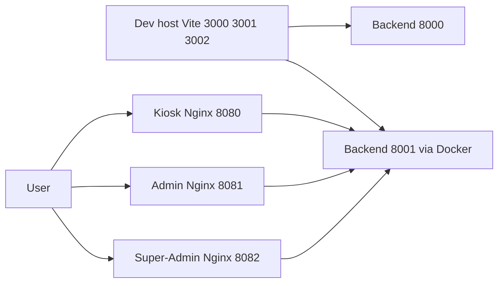

# Frontend Setup Guide

This project uses a modular monorepo architecture: each frontend app lives under frontend/apps as an independent module.

This guide explains how to develop and test the three independent frontend applications:
- Kiosk (customer interface)
- Admin
- Super-Admin

Each app uses React, TypeScript, Vite, and Tailwind CSS, and can be:
- Run locally with Vite (no Docker)
- Built and served via its own Docker image (Nginx)

## Prerequisites

- Node.js >= 18 and npm >= 9
- (Optional) Docker and Docker Compose
- Backend API available on:
  - http://localhost:8000 for local backend, or
  - http://localhost:8001 when backend runs with docker-compose

## Backend Setup (for API)

Option A: Run locally without Docker

```bash
cd backend
python main.py  # Starts FastAPI on http://localhost:8000
```

Option B: Run with Docker (without frontend)

```bash
docker compose up -d postgres redis
docker compose up -d backend     # Exposes backend on http://localhost:8001
```

---

## Local Development per-App (No Docker)

For each frontend application, navigate into its directory, install dependencies using pnpm, and start the development server:

Kiosk (http://localhost:3000):
```bash
cd frontend/apps/kiosk
pnpm install
pnpm dev
```
Admin (http://localhost:3001):
```bash
cd frontend/apps/admin
pnpm install

```
Super-Admin (http://localhost:3002):
```bash
cd frontend/apps/super-admin
pnpm install
pnpm dev
```

Notes:
- Default Vite proxies target http://localhost:8000. If your backend runs in Docker at http://localhost:8001, update each app’s Vite proxy target in [frontend/apps/kiosk/vite.config.ts](frontend/apps/kiosk/vite.config.ts), [frontend/apps/admin/vite.config.ts](frontend/apps/admin/vite.config.ts), [frontend/apps/super-admin/vite.config.ts](frontend/apps/super-admin/vite.config.ts) to use 8001.
- Tailwind CSS globals live in each app’s index.css:
  - [frontend/apps/kiosk/src/index.css](frontend/apps/kiosk/src/index.css)
  - [frontend/apps/admin/src/index.css](frontend/apps/admin/src/index.css)
  - [frontend/apps/super-admin/src/index.css](frontend/apps/super-admin/src/index.css)

---

## Run Each App with Docker (Per-App Images)

Build and run production-like images per app using docker-compose profiles:

Kiosk (Nginx on http://localhost:8080):
```bash
docker compose --profile kiosk up --build -d kiosk-frontend
```

Admin (Nginx on http://localhost:8081):
```bash
docker compose --profile admin up --build -d admin-frontend
```

Super-Admin (Nginx on http://localhost:8082):
```bash
docker compose --profile superadmin up --build -d superadmin-frontend
```

Stop and remove:
```bash
docker compose --profile kiosk down
docker compose --profile admin down
docker compose --profile superadmin down
```
### Using the start-docker.sh script

You can also start frontend services using the `scripts/start-docker.sh` script with per-app flags:

```bash
# Kiosk frontend only
./scripts/start-docker.sh --kiosk

# Admin frontend only
./scripts/start-docker.sh --admin

# Super-Admin frontend only
./scripts/start-docker.sh --superadmin

# All frontends
./scripts/start-docker.sh --frontend
```

Per-app Dockerfiles and Nginx configs:
- [frontend/apps/kiosk/Dockerfile](frontend/apps/kiosk/Dockerfile), [frontend/apps/kiosk/nginx.conf](frontend/apps/kiosk/nginx.conf)
- [frontend/apps/admin/Dockerfile](frontend/apps/admin/Dockerfile), [frontend/apps/admin/nginx.conf](frontend/apps/admin/nginx.conf)
- [frontend/apps/super-admin/Dockerfile](frontend/apps/super-admin/Dockerfile), [frontend/apps/super-admin/nginx.conf](frontend/apps/super-admin/nginx.conf)

---

## Aggregated Frontend Image (Optional)

An aggregated workspace image remains available:
- Service: frontend
- Build context: [frontend/Dockerfile](frontend/Dockerfile)
- Profile: frontend

Start it if needed:
```bash
docker compose --profile frontend up --build -d frontend
```

---

## Port Matrix

- Local dev (Vite):
  - Kiosk: http://localhost:3000
  - Admin: http://localhost:3001
  - Super-Admin: http://localhost:3002
- Docker (Nginx):
  - Kiosk: http://localhost:8080
  - Admin: http://localhost:8081
  - Super-Admin: http://localhost:8082
- Backend:
  - Local: http://localhost:8000
  - Docker: http://localhost:8001

---

## CORS and API Target

- docker-compose backend now allows origins for 3000/3001/3002 and 8080/8081/8082.
- For local dev when backend runs in Docker, update Vite proxy targets in:
  - [frontend/apps/kiosk/vite.config.ts](frontend/apps/kiosk/vite.config.ts)
  - [frontend/apps/admin/vite.config.ts](frontend/apps/admin/vite.config.ts)
  - [frontend/apps/super-admin/vite.config.ts](frontend/apps/super-admin/vite.config.ts)
  from http://localhost:8000 to http://localhost:8001.

---

## Troubleshooting

- Port already in use: change the dev port via the package.json scripts or stop the process using the port.
- API calls fail in dev while backend is in Docker: ensure Vite proxy targets http://localhost:8001.
- After changing CORS or ports, restart the backend container:
  ```bash
  docker compose restart backend
  ```
- If docker builds fail on workspaces, try clearing caches:
  ```bash
  docker builder prune -f
  ```

---

## Architecture Overview



End of Frontend Setup Guide